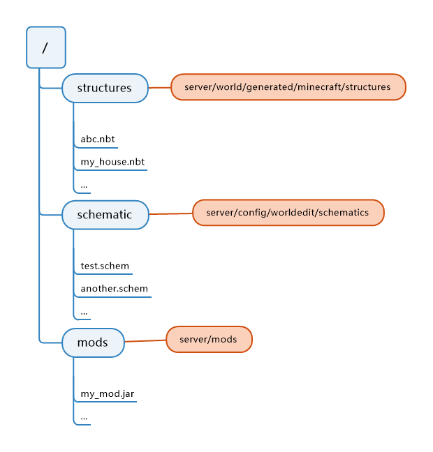

Lite File Manager
-----------

一个轻量级的游戏内文件管理器，提供目录浏览、文件导入导出功能。其中文件导出借助了文件临时中转站 [uguu.se](https://uguu.se/) 或 [tmp.ninja](https://tmp.ninja/) 实现



## 需求

- [MCDR](https://github.com/Fallen-Breath/MCDReforged) >=1.5.0

## 配置

配置文件为 `config/lite_file_manager/config.json`，默认配置文件如下

```json
{
    "permission_requirement": 2,
    "max_import_size": 10485760,
    "file_per_page": 10,
    "directories": {
        "structures": {
            "path": "./server/world/generated/minecraft/structures",
            "permission": {
                "read": 2,
                "write": 3
            }
        }
    }
}
```

- `permission_requirement`: 使用 `!!lfm` 指令的权限需求等级
- `max_import_size`: 导入文件的最大文件大小
- `file_per_page`: 分页显示当前目录时每页显示的文件数
- `directories`: 一个字典，用于描述根目录下的文件夹映射。其中的键表示映射后的文件夹名，值为一个字典，含义如下
  - `path`: 该文件夹映射的对应的物理文件夹位置
  - `permission`: 该文件夹的读/写权限需求等级

## 指令

- `!!lfm` 显示此帮助信息
- `!!lfm ls [<page>]` 列出当前目录下的文件。可指定显示的页数
- `!!lfm search <keyword> [<page>]` 列出当前目录下包含 `<keyword>` 的文件。可指定显示的页数
- `!!lfm pwd` 显示当前所在的目录
- `!!lfm cd <path>` 进入指定目录。目录可为相对路径，或以/开头的绝对路径
- `!!lfm delete <file_name>` 删除当前目录下的指定文件。需要写入权限
- `!!lfm rename <file_name> <new_name>` 重命名当前目录下的指定文件。需要写入权限
- `!!lfm export <file_name>` 导出当前目录下的指定文件
- `!!lfm import <url> [<file_name>]` 从给定 url 下载并导入文件至当前目录，可指定保存的文件名。需要写入权限

## 日志

所有与文件相关的操作将会记录于 `config/lite_file_manager/action_record.log` 文件中。操作包含：

- 文件删除
- 文件重命名
- 文件导出
- 文件导入
